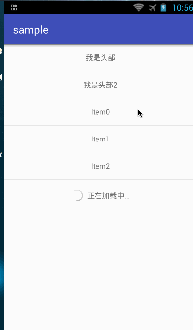
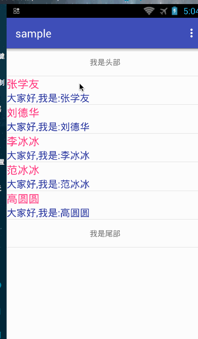
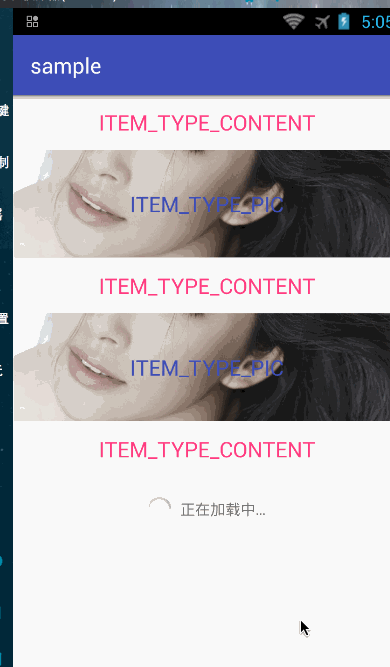

#LMRecycleViewAdapter（[中文文档](https://github.com/Allure0/LMRecycleAdapter/blob/master/README_CN.md)）
-------------
It's a simple, versatile, support for multiple characteristics of RecycleAdapter.

##Features

- Optimized code to reduce ViewHolder writing,quick create RecycleAdapter
- Support Item's Click,LongClick.Also Item child's Listener.
- Only One line ofcode can set Item child's value and listener
- Support add more header or footer,also u can remove it.
- Support loadmore.if u like u can set custom loadmore view.(Uhh,If U need use Refresh and Loadmore,I suggest use [android.support.v4.widget.SwipeRefreshLayout]() Or [android-Ultra-Pull-To-Refresh](https://github.com/liaohuqiu/android-Ultra-Pull-To-Refresh)）)
- Support more ItemType 
- Support EmtypView

###[APK Download](https://raw.githubusercontent.com/Allure0/LMRecycleAdapter/master/demo/sample-debug.apk)


### Gradle
Gradle:  
```
dependencies {
  compile 'com.allure0:LMRecycleViewAdapter:1.0.0'
}
```
###Normal Adapter Use：

```

 mTestAdapter = new TestAdapter(this, R.layout.test_recycle_item, list);
        mHeaderAndFooterWrapper = new HeaderAndFooterWrapper(mTestAdapter);
        mRecyclerView.setAdapter(mHeaderAndFooterWrapper);

 public class TestAdapter extends BaseCleanRecycleAdapter<TestBean> {


    public TestAdapter(Context context, int layoutResId, List<TestBean> data) {
        super(context, layoutResId, data);
    }

    @Override
    protected void convert(final BaseViewHolderHelper helper, TestBean item, final int position) {
        helper.setText(R.id.name, item.getName())
                .setText(R.id.desc, item.getDesc());
        //Onclick
        helper.setOnClickListener(R.id.name, new View.OnClickListener() {
            @Override
            public void onClick(View v) {
                Log.e("Position",position+"");
            }
        });
       /* //OnLongClick
        helper.setOnLongClickListener();
        //OnTouch
        helper.setOnTouchListener();*/
    }

```
###Item Onlcik、OnLongClick
```

   mTestAdapter.setOnItemClickListener（）;
   mTestAdapter.setOnItemLongClickListener（）;

```
###Item Child Onlcik、OnLongClick
```

    //Onclick
        helper.setOnClickListener(R.id.name, new View.OnClickListener() {
            @Override
            public void onClick(View v) {
                Log.e("Position",position+"");
            }
        });
       /* //OnLongClick
        helper.setOnLongClickListener();
        //OnTouch
        helper.setOnTouchListener();*/

```

###EmptyView
```

 --------XML START--------
  <RelativeLayout
        android:layout_width="fill_parent"
        android:layout_height="fill_parent">

    <com.allure.lmrecycleadapter.loadmore.LMRecycleView
        android:id="@+id/recycle_view"
        android:layout_width="fill_parent"
        android:layout_height="fill_parent"
        />
    <RelativeLayout
        android:id="@+id/empty"
        android:layout_width="match_parent"
        android:layout_height="match_parent">

        <TextView
            android:layout_width="wrap_content"
            android:layout_height="wrap_content"
            android:layout_centerHorizontal="true"
            android:layout_centerVertical="true"
            android:text="空View" />
    </RelativeLayout>
    </RelativeLayout>
 --------XML END--------
 
 
 --------JAVA CODE ------
 mRecyclerView.setAdapter(mHeaderAndFooterWrapper);
 mRecyclerView.setEmptyView(emptyView);
 --------JAVA CODE ------
 
```

###LoadMore

```

  LMRecycleView  mRecyclerView = (LMRecycleView) findViewById(R.id.recycle_view);
  
 private void initLoadMore() {
        //you can use  custom loadmore view,DefaultLoadMore just a default view
        mRecyclerView.setFooterView(new DeaultLoadMoreFooter(this));
        //loadMore(true)
        mRecyclerView.setCanLoadMore(true);
        //Max Count
        mRecyclerView.setAllCountSize(20);
        //LoadMore CallBack
        mRecyclerView.setOnLoadMore(new LMRecycleView.OnLoadMoreListener() {
            @Override
            public void onLoadmore() {
               mSwipeRefreshLayout.setEnabled(false);
                new Handler().postDelayed(new Runnable() {
                    @Override
                    public void run() {
                        List<TestBean> mlTestBeen = new ArrayList<TestBean>();
                        for (int i = 0; i < 2; i++) {
                            TestBean testBean = new TestBean();
                            testBean.setName("新增" + name[i]);
                            testBean.setDesc("大家好,我是新增:" + name[i]);
                            mlTestBeen.add(testBean);
                        }
                        mTestAdapter.setList(mlTestBeen);
                        mRecyclerView.loadMoreCommplete();
                        mSwipeRefreshLayout.setEnabled(true);
                    }
                }, 3000);
            }
        });
    }
```

###Add Header Or Footer



```

        mHeaderAndFooterWrapper.addHeaderView(mHeaderLayout);
        mHeaderAndFooterWrapper.addFooterView(mFooterLayout);
//      mHeaderAndFooterWrapper.removeHeaderView(mHeaderLayout);
//      mHeaderAndFooterWrapper.removeFooterView(mFooterLayout);
```
### More ItemType



```
<------------Activity Or Fragment------------------>

          MultiItemTypeSupport<MutiBean> multiItemTypeSupport = new MultiItemTypeSupport<MutiBean>() {
            @Override
            public int getLayoutId(int viewType) {
                if (viewType == MutiBean.ITEM_TYPE_CONTENT) {
                    return R.layout.multi_item_text;
                } else if (viewType == MutiBean.ITEM_TYPE_PIC) {
                    return R.layout.multi_item_image;
                }

                return viewType;
            }


            @Override
            public int getItemViewType(int position, MutiBean news) {
                return news.getItemType();
            }
        };
        mMutiAdapter=new MutiAdapter(this,multiItemTypeSupport,list);
        
<------------Adapter------------------>
 @Override
    protected void convert(BaseViewHolderHelper helper, MutiBean item, int position) {
        switch (helper.getItemViewType()) {
            case MutiBean.ITEM_TYPE_CONTENT:
                helper.setText(R.id.text_content,item.getContent());
                break;
            case MutiBean.ITEM_TYPE_PIC:
                helper.setImageResource(R.id.image,item.getResoucre());

                break;

        }
    }    
        
```
###Tips
If u use  HeaderAndFooterWrapper, if datas have changed,please use mHeaderAndFooterWrapper.notifyDataSetChanged(）Update change data 。
Otherwise the data will show that it is not normal。

###TODO

If there is BUG or question,please submit Issues。
or QICQ group:[482906631]()
or gail:[qq395118726@gmail.com]()

###Thanks
[base-adapter-helper](https://github.com/JoanZapata/base-adapter-helper)


## License
Copyright 2016 Allure

Licensed under the Apache License, Version 2.0 (the "License");
you may not use this file except in compliance with the License.
You may obtain a copy of the License at

   http://www.apache.org/licenses/LICENSE-2.0

Unless required by applicable law or agreed to in writing, software
distributed under the License is distributed on an "AS IS" BASIS,
WITHOUT WARRANTIES OR CONDITIONS OF ANY KIND, either express or implied.
See the License for the specific language governing permissions and
limitations under the License.
